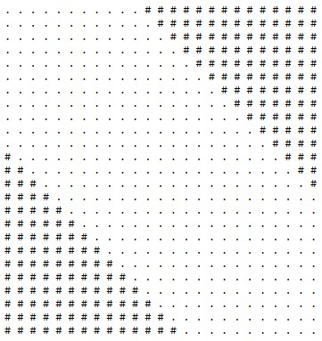
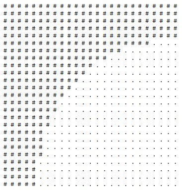

# OTUS C++ Алгоритмы и структуры данных

## Квадратные заклинания

В данном репозитии реализована программа, которая выводит "квадратные заклинания" для того, чтобы реализовать рисунок на предложенных картинках

## Инструкция по сборке

Требуется компиялтор с поддержкой C++17

## Примеры картинок

