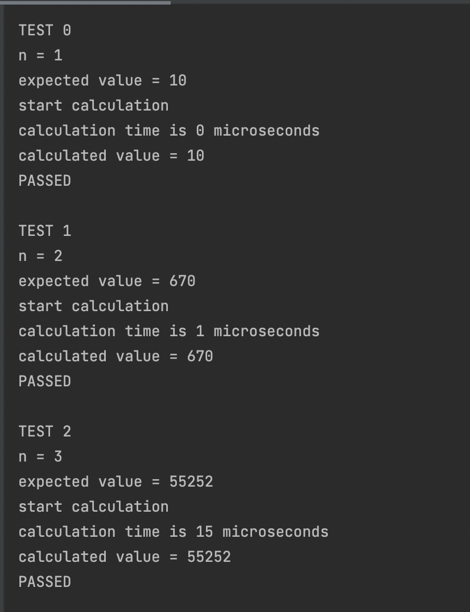
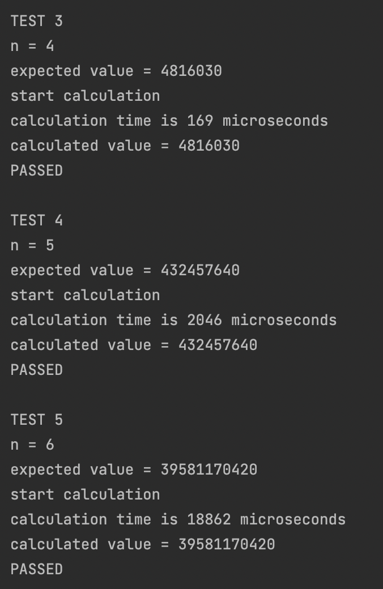
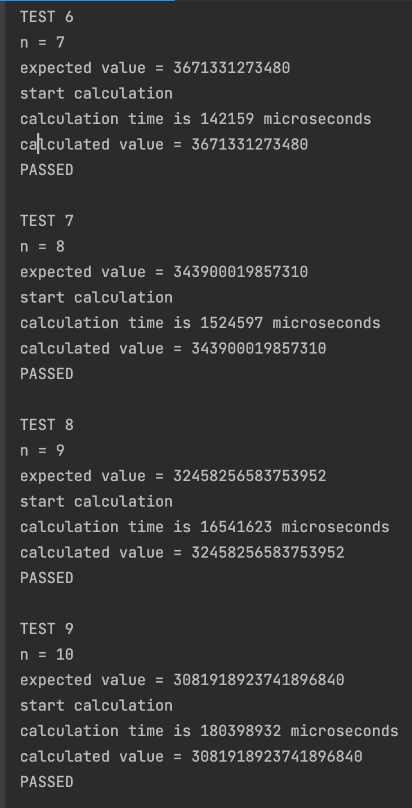

# OTUS C++ Алгоритмы и структуры данных

## «Счастливые билеты»

В данном репозитии реализован:
- алгоритм подсчета количество "счастливых билетов" для n-значных билетов. Билет считается счастливым, если сумма первых n цифр совпадает с суммой последних n цифр.
- механизм подсчета времени работы алгоритма;
- функция проверки корректности работы алгоритма на основе тестов из папки "1.Tickets" (правда, количество тестов в папке задаю вручную);

## Комментарии
Аппаратная среда:
- Model Name:	MacBook Pro
- Chip:	Apple M1 Pro
- Total Number of Cores:	8 (6 performance and 2 efficiency)
- Memory:	16 GB

Для n=9 алгоритм работает порядка 16 секунд.
Для n=10 алгоритм работает порядка 3 минут.

## Инструкция по сборке

Требуется компиялтор с поддержкой C++17

## Результаты работы

