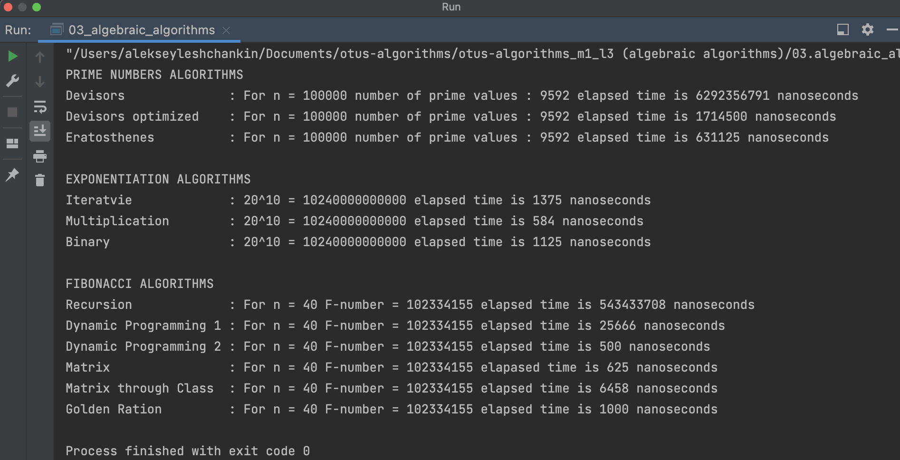

# OTUS C++ Алгоритмы и структуры данных

## Алгебраические алгоритмы

В данном репозитии реализован:
- итеративный O(N) алгоритм возведения числа в степень;
- алгоритм возведения в степень через домножение O(N/2+LogN) = O(N);
- алгоритм возведения в степень через двоичное разложение показателя степени O(2LogN) = O(LogN);

- алгоритм поиска количества простых чисел через перебор делителей O(N^2);
- алгоритм поиска простых чисел с оптимизациями поиска и делением только на простые числа, O(N * Sqrt(N) / Ln (N));
- алгоритм "Решето Эратосфена" для быстрого поиска простых чисел O(N Log Log N);

- рекурсивный O(2^N) алгоритм поиска чисел Фибоначчи;
- итеративный O(N) алгоритм поиска чисел Фибоначчи (O(N) memory);
- итеративный O(N) алгоритм поиска чисел Фибоначчи (O(1) memory);
- алгоритм поиска чисел Фибоначчи O(LogN) через умножение матриц;
- класс умножения матриц;
- алгоритм поиска чисел Фибоначчи O(LogN) через умножение матриц, используя класс матриц;
- алгоритм поиска чисел Фибоначчи по формуле золотого сечения;

- cоставлена сравнительная таблица алгоритмов по быстродействию.

## Время работы алгоритма
Аппаратная среда:
- Model Name:	MacBook Pro
- Chip:	Apple M1 Pro
- Total Number of Cores:	8 (6 performance and 2 efficiency)
- Memory:	16 GB

## Инструкция по сборке

Требуется компиялтор с поддержкой C++17

## Результаты работы

