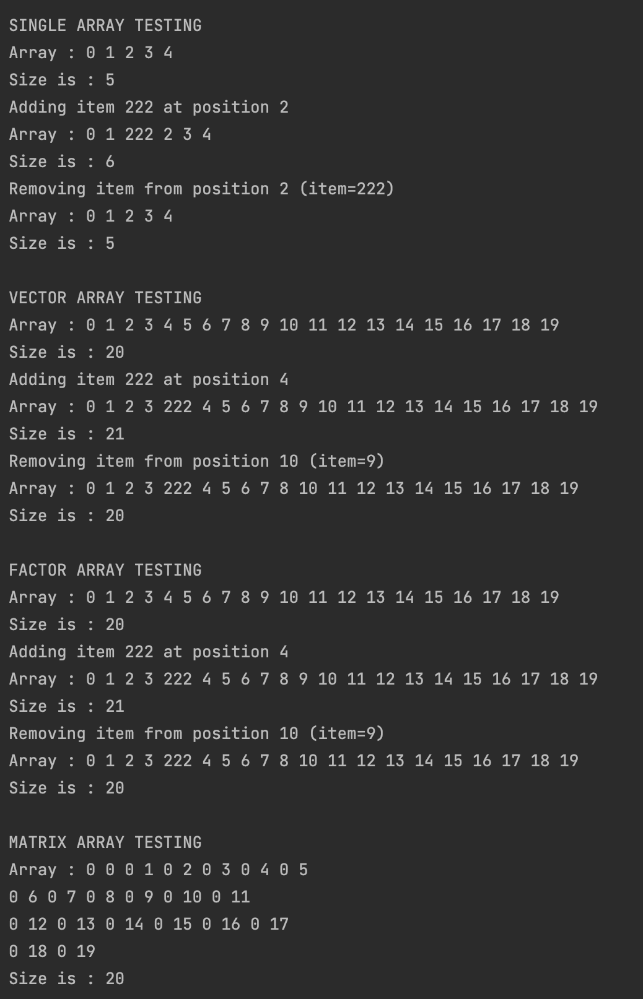
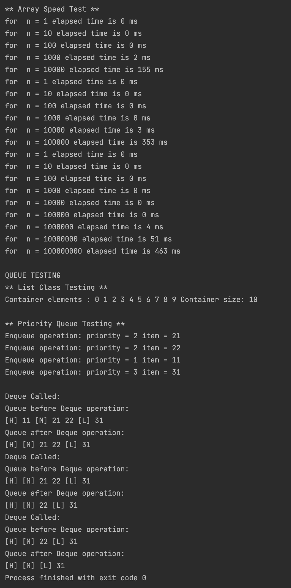

# OTUS C++ Алгоритмы и структуры данных

## Базовые структуры данных

В данном репозитии реализован:
- класс SingleArray;
- класс VectorArray;
- класс FactorArray;
- (частично) класс MatrixArray;
- очередь с приоритетатами

- cоставлена таблица сравнения времени выполнения операций вставки в конец для разных массивов с разным порядком значений

## Время работы алгоритма
Аппаратная среда:
- Model Name:	MacBook Pro
- Chip:	Apple M1 Pro
- Total Number of Cores:	8 (6 performance and 2 efficiency)
- Memory:	16 GB

## Инструкция по сборке

Требуется компиялтор с поддержкой C++17

## Результаты работы
