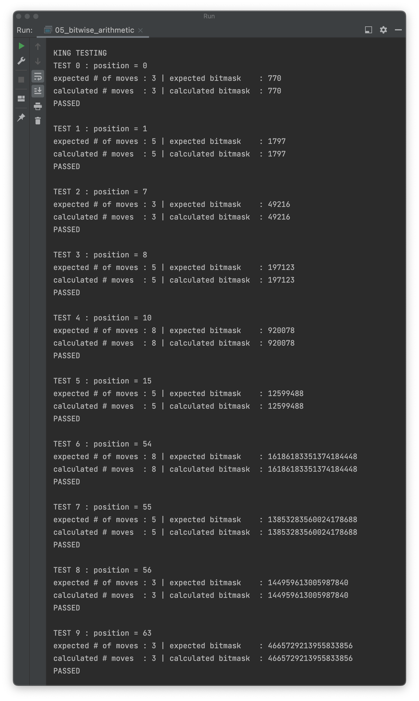
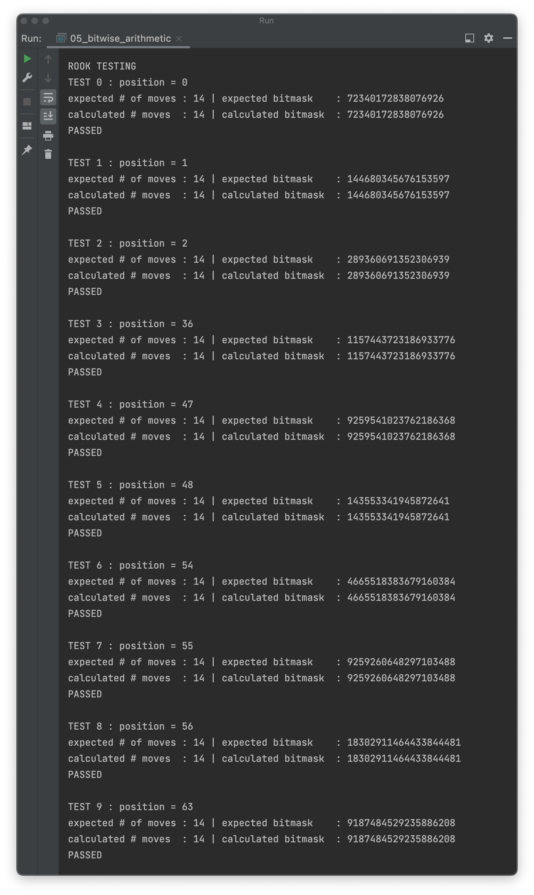
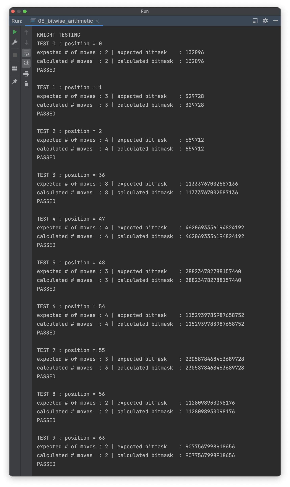
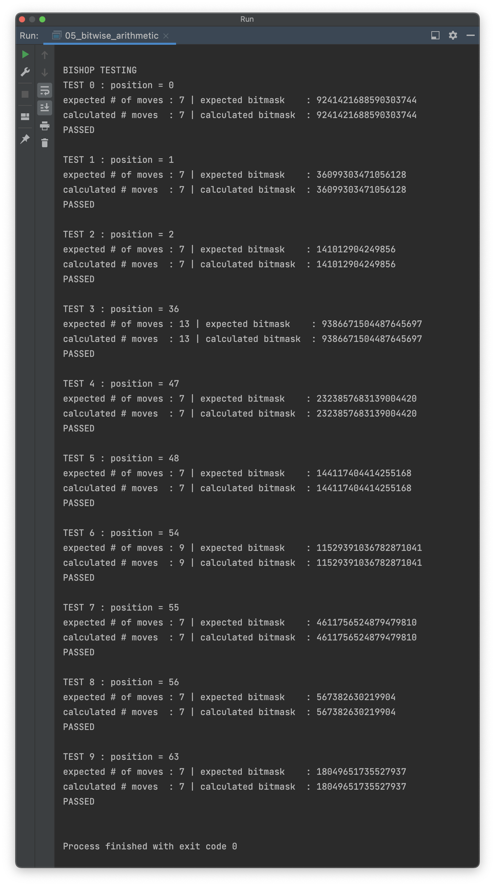

# OTUS C++ Алгоритмы и структуры данных

## Битовая арифметика

В данном репозитии реализованы алгоритмы расчета количества возможных ходов различных шахматных фигур
и ulong число с установленными битами тех полей, куда фигура может ходить. В частности, алгоритм реализован для фигуры:
- Короля (GetKingMoves.h);
- Ладьи (GetRookMoves.h);
- Коня (GetKnightMoves.h);
- Слона (GetBishopMoves.h)

Также реализованы (файл CountingSingleBits.h): 
- два алгоритма подсчёта единичных битов в числе;
- алгортим подсчёта единичных битов через кэширование

## Материалы по теме
Автор материалов - очень крутой человек Волосатов Евгений https://habr.com/ru/users/FFormula/ 
- [Статья Евгения](https://habr.com/ru/company/otus/blog/476510/)
- [Очень полезная интерактивная тула](https://gekomad.github.io/Cinnamon/BitboardCalculator/)

## Время работы алгоритма
Аппаратная среда:
- Model Name: MacBook Pro
- Chip:	Apple M1 Pro
- Total Number of Cores: 10 (8 performance and 2 efficiency)
- Memory: 32 GB

## Инструкция по сборке

Требуется компиялтор с поддержкой C++17

## Результаты работы

  
  
  
  

