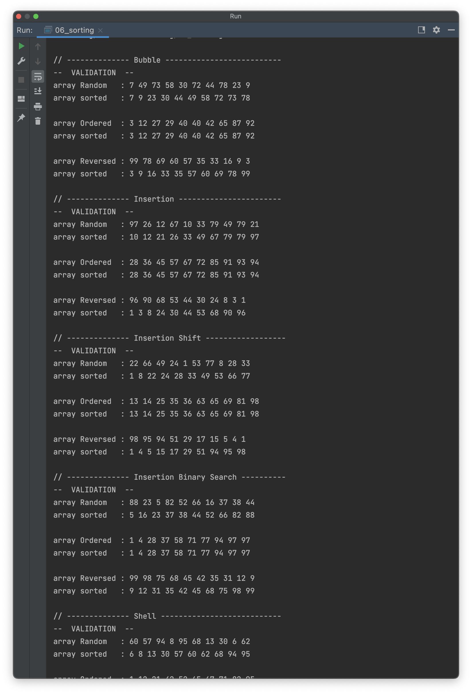
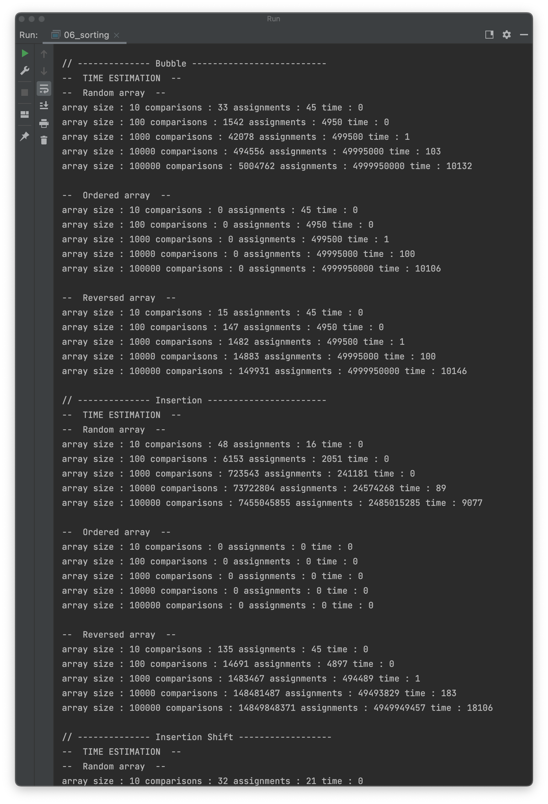
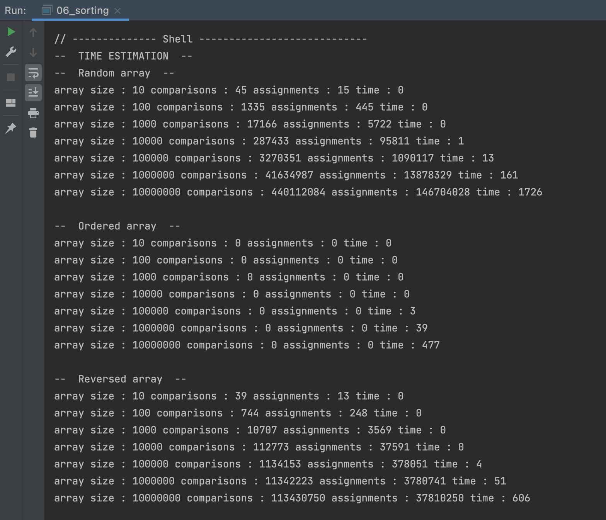
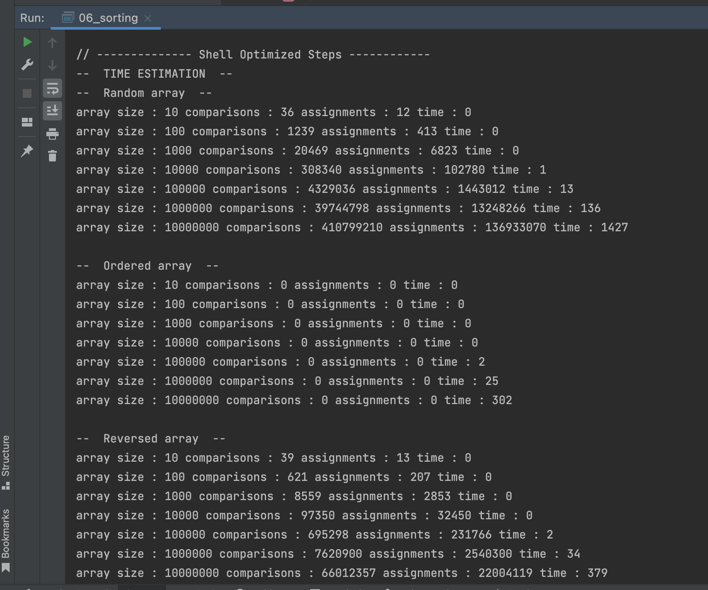

# OTUS C++ Алгоритмы и структуры данных

## Простые сортировки

В данном репозитии реализованы алгоритмы сортировки:
- пузырьком (Bubble);
- вставками (Insertion);
- вставками со сдвигом элементов вместо обмена (InsertionShift);
- вставками с бинарым поиском вместо вставок (InsertionBinarySearch);
- шелла (Shell)
- шелла с птимальной схемой выбора шагов (ShellHStep)

Также реализованы: 
- генерация массива случайных чисел (в т.ч. отсортированного (GenerateArrayOrdered) и обратно-отсортированного (GenerateArrayReversed));
- функции чтения массива из файла и записи отсортированного массива в файл

## Материалы по теме
- [Выбор шага для Shell Sort](https://www.epaperpress.com/sortsearchRussian/shl.html)

## Инструкция по сборке

Требуется компиялтор с поддержкой C++17

## Результаты работы

Аппаратная среда:
- Model Name: MacBook Pro
- Chip:	Apple M1 Pro
- Total Number of Cores: 10 (8 performance and 2 efficiency)
- Memory: 32 GB

  
  
  
  

