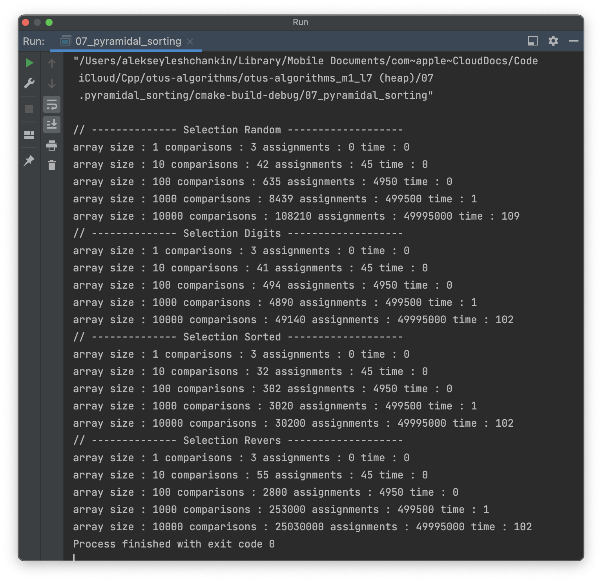

# OTUS C++ Алгоритмы и структуры данных

## Пирамидальные сортировки

В данном репозитии реализованы алгоритмы сортировки:
- SelectionSort;
- HeapSort

Также реализованы проверки корректности работы алгоритмов на синтетических данных (RunCorrectnessTest):
- массив случайных чисел размером 15 (GenerateArrayRandom);
- массив случайных чисел размером 15 отсортированный (GenerateArrayOrdered);
- массив случайных чисел размером 15 обратно-отсортированный (GenerateArrayOrdered)

Выполнено тестирование алгоритмов на массивах размером: 1, 10, 100, 1.000, 10.000, 100.000, 1.000.000, 10.000.000 (для HeapSort)
И с различным характером данных:
- а) random - массив из случайных чисел;
- б) digits - массив из случайных цифр;
- в) sorted - на 99% отсортированный массив;
- г) revers - обратно-отсортированный массив

Результаты тестов - числа из отсортированного массива - записываются в папку "sorting-tests-result" в одну строчку через пробел. Формат 
файла: "название алгоритма" + "номер теста" + ".out":

  

## Инструкция по сборке

Требуется компиялтор с поддержкой C++17

## Результаты работы

Аппаратная среда:
- Model Name: MacBook Pro
- Chip:	Apple M1 Pro
- Total Number of Cores: 10 (8 performance and 2 efficiency)
- Memory: 32 GB

  
  
  

