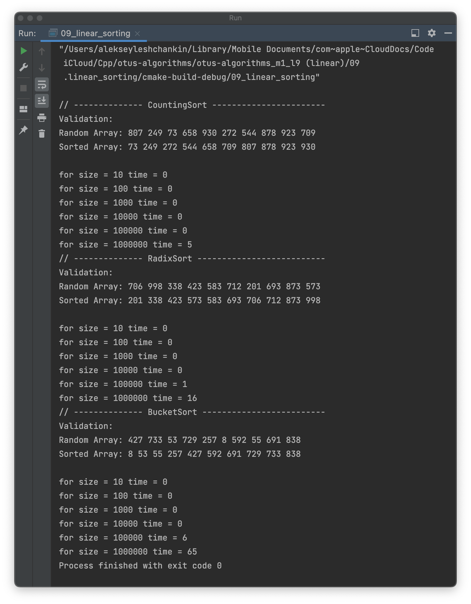

# OTUS C++ Алгоритмы и структуры данных

## Линейная сортировка

В данном репозитии реализованы алгоритмы сортировки:
- CountingSort;
- RadixSort;
- BucketSort

Проведено тестирование алгоритмов на массиве случайных чисел (из диапазон от 0 до 999) размером 10^2, 10^3, 10^4, 10^5, 10^6.

## Инструкция по сборке

Требуется компиялтор с поддержкой C++17

## Результаты работы

Аппаратная среда:
- Model Name: MacBook Pro
- Chip:	Apple M1 Pro
- Total Number of Cores: 10 (8 performance and 2 efficiency)
- Memory: 32 GB

  

