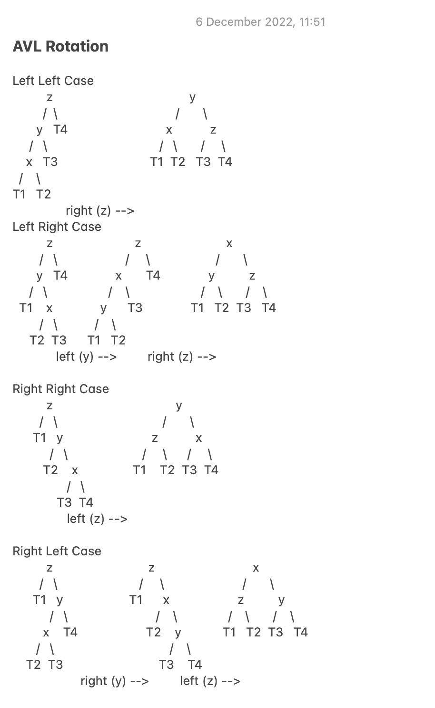
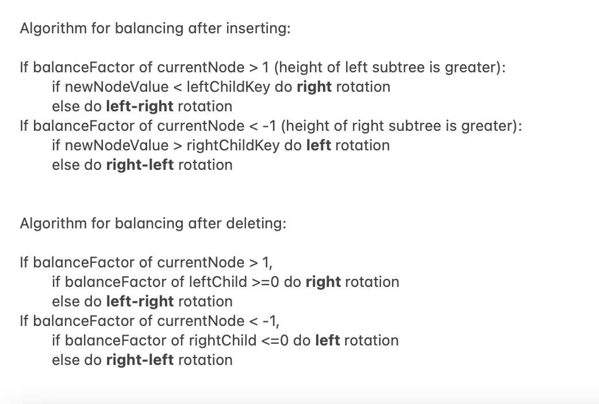
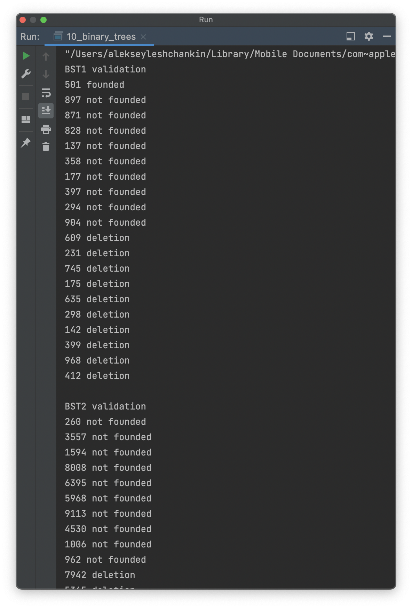

# OTUS C++ Алгоритмы и структуры данных

## Двоичные деревья поиска АВЛ

В данном репозитии реализовано:
- простейшее двоичное дерево поиска с методами:
  - void insert(int x) - вставка элемента;
  - bool search(int x) - поиск элемента; 
  - void remove(int x) - удаление элемента

- сбалансированное АВЛ-дерево:
  - void insert(int x) - вставка элемента;
  - bool search(int x) - поиск элемента;
  - void remove(int x) - удаление элемента
  - малое левое (right right case) / правое (left left case) вращение
  - большое левое (right left case)/правое вращение (left right case) - реализованы через вызов малых вращений

## Комментарии к алгоритмам

  
  

## Инструкция по сборке

Требуется компиялтор с поддержкой C++17

## Результаты работы

  

