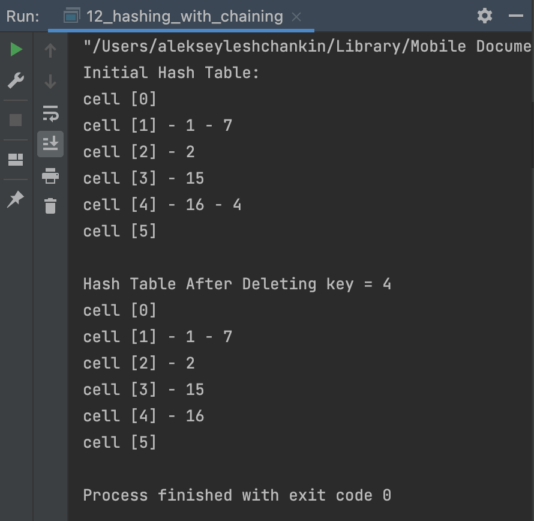

# OTUS C++ Алгоритмы и структуры данных

## Двоичные деревья поиска АВЛ

В данном репозитии реализована хеш-таблицу, использующая метод цепочек

## Инструкция по сборке

Требуется компиялтор с поддержкой C++17

## Результаты работы

  

