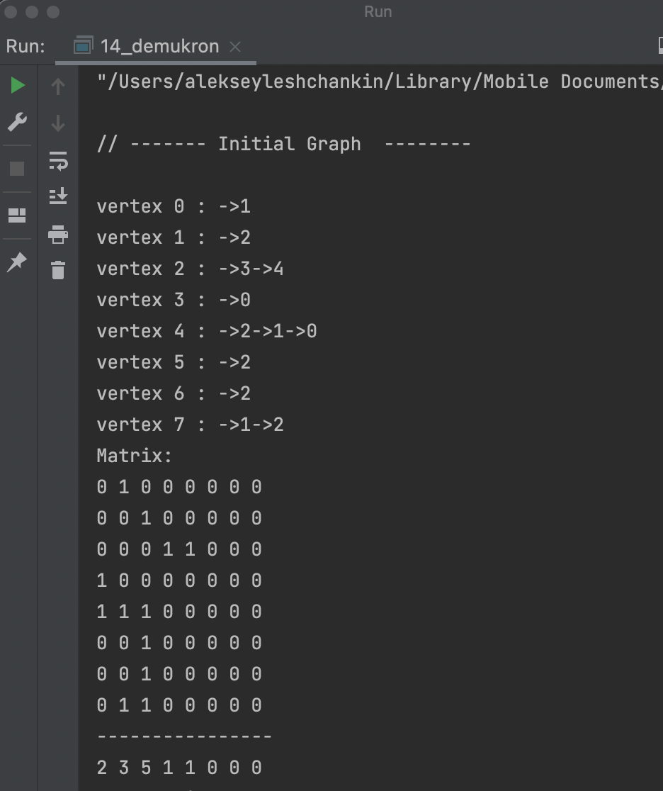
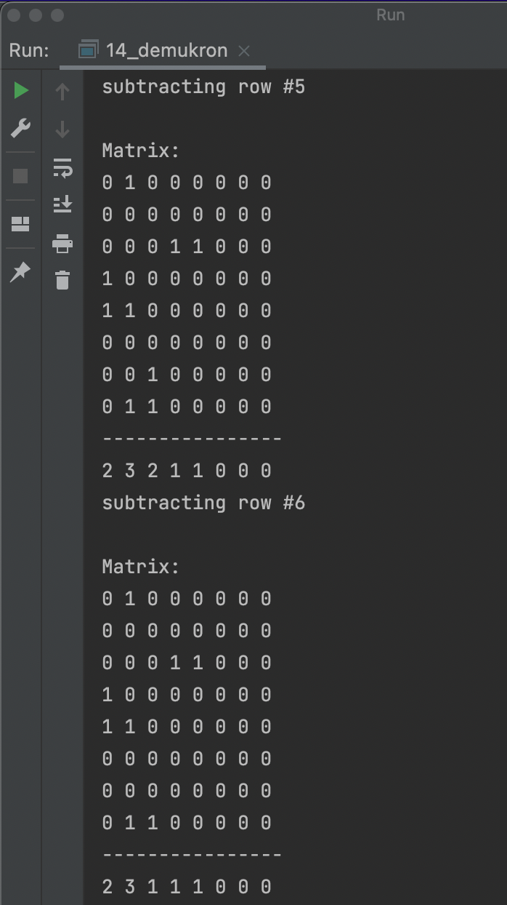
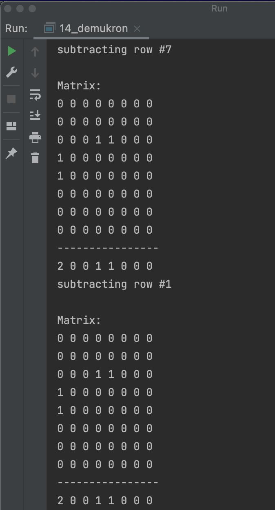
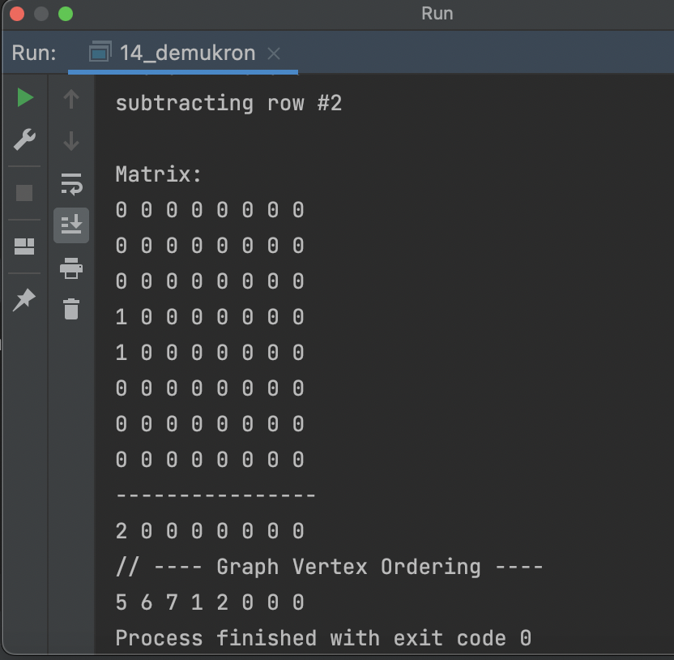

# OTUS C++ Алгоритмы и структуры данных

## Алгоритм Демукрона

В данном репозитии реализован алгоритм Демукрона. Этот алгоритм решает задачу топологической сортировки, 
то есть упорядочения вершин графа по их уровням для бесконтурного ориентированного графа.

## Инструкция по сборке

Требуется компиялтор с поддержкой C++17

## Результаты работы

  

