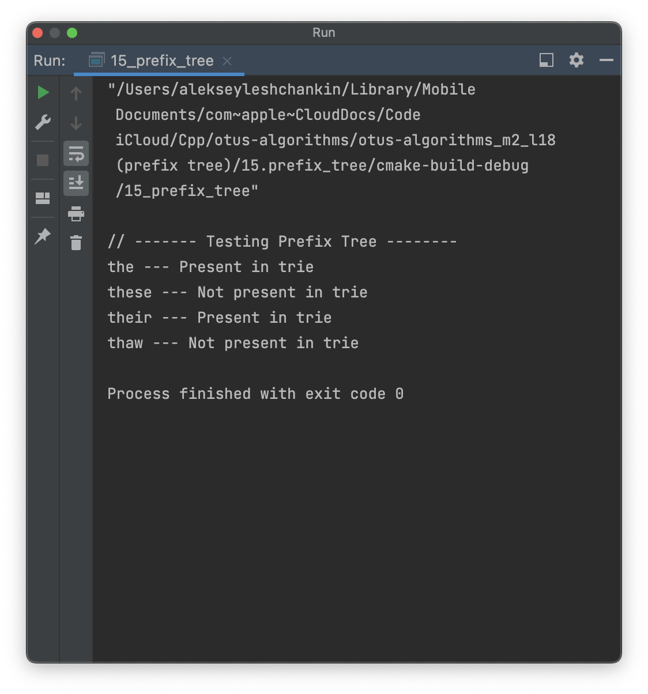

# OTUS C++ Алгоритмы и структуры данных

## Префиксное дерево

В данном репозитии реализован алгоритм решения задачи №208 https://leetcode.com/problems/implement-trie-prefix-tree/

## Инструкция по сборке

Требуется компиялтор с поддержкой C++17

## Результаты работы

  

