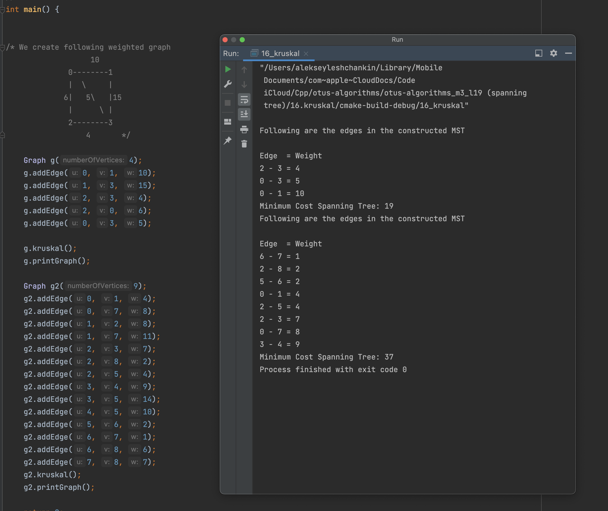

# OTUS C++ Алгоритмы и структуры данных

## Минимальное остовное дерево

В данном репозитии реализован алгоритм Краскала (https://en.wikipedia.org/wiki/Kruskal%27s_algorithm). Шаги алгоритма:
1. Отсортировать все ребра в порядке неубывания их веса.
2. Выбрать наименьшее ребро. Проверить, образует ли он цикл с уже сформированным остовным деревом. 
   Если цикл не сформирован, включить это ребро. В противном случае отказаться от него.
3. Повторять шаг №2, пока в остовном дереве не будет (V-1) ребер.

Ряд функций реализовано с использованием STL, в частности:
1. vector<pair <int, edge> >
2. std::sort

## Инструкция по сборке

Требуется компилятор с поддержкой C++17

## Результаты работы

    

