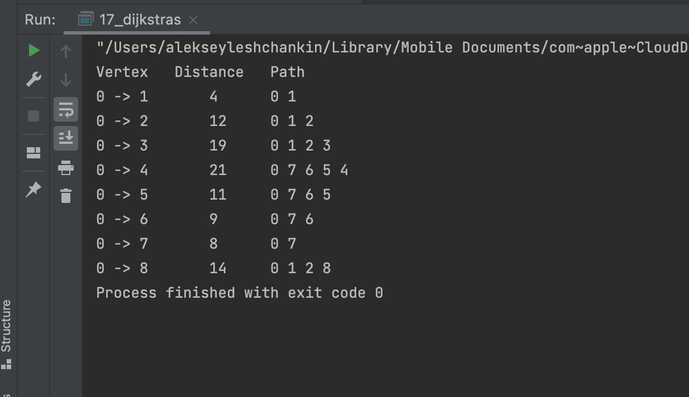

# OTUS Алгоритмы и структуры данных

## Кратчайший путь

В данном репозитии реализован алгоритм Дейкстры

## Инструкция по сборке

Требуется компилятор с поддержкой C++17

## Результаты работы

    

