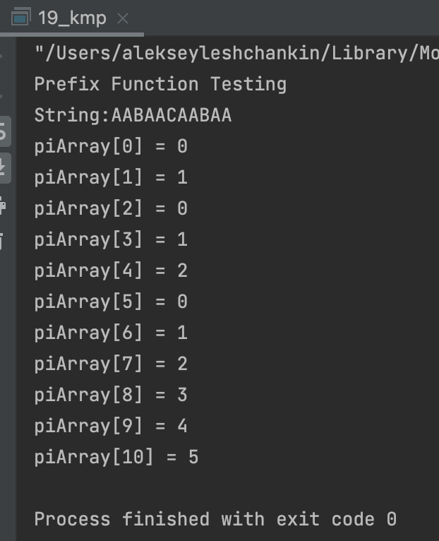
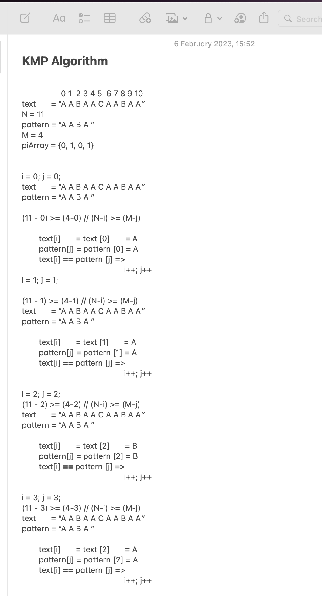

# OTUS Алгоритмы и структуры данных

## Алгоритм Кнута-Морриса-Пратта

В данном репозитии реализованы:
- функция вычисления префикс-функции;
- алгоритм Кнута-Морриса-Пратта

Как реализован препроцессинг (функция void createPiArray):
- Вычисляем значения в piArray[]. Для этого отслеживаем длину самого длинного значения суффикса - префикса (используем для этой цели переменную len) для предыдущего индекса
- Инициализируем piArray[0] и len нулем
- Если pattern[i] и pattern[len] совпадают, увеличиваем len на 1 и присваиваем увеличенное значение piArray[i]
- Если pattern[i] и pattern[len] не совпадают и len не равен 0, обновляем len до piArray[len-1]

На рисунках ниже представлен ручной проход алгоритма и результаты работы кода:

    
    

Как реализован алгоритм (функция void KMPsearch):
- Начинаем сравнение pattern[j] (где j = 0) с символами текущего “окна” текста
- Продолжаем сопоставлять символы text[i] и pattern[j]; также продолжаем увеличивать i и j, пока pattern[j] и text[i] совпадают
- Когда символы не совпали
    - Нам известно, что символы pattern[0..j-1] совпадают с text[i-j…i-1] (j начинается с 0 и увеличивается только при совпадении)
    - Также мы знаем, что piArray[j-1] - это количество символов pattern[0…j-1], которые являются как правильными префиксами, так и суффиксами.
- Из приведенных выше двух пунктов мы можем сделать вывод, что нам не нужно сопоставлять  piArray[j-1] с text[i-j…i-1], потому эти символы всегда будут совпадать

    
    

## Инструкция по сборке

Требуется компилятор с поддержкой C++17

## Результаты работы

    

