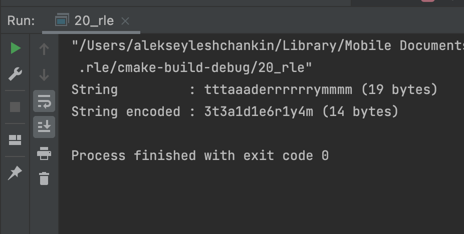

# OTUS Алгоритмы и структуры данных

## Алгоритмы сжатия

В данном репозитии реализованы:
- алгоритм сжатия Run-Length-Encoding

## Инструкция по сборке

Требуется компилятор с поддержкой C++17

## Результаты работы

    

