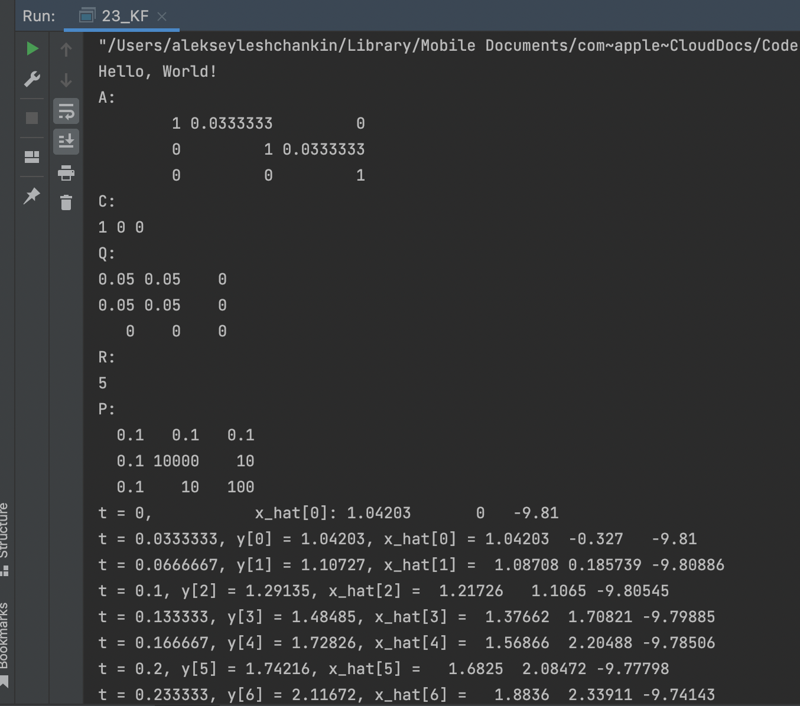

# OTUS Алгоритмы и структуры данных

## Проектная работа

В данном репозитии реализованы:
- фильтр Калмана

## Инструкция по сборке

Требуется компилятор с поддержкой C++17

## Результаты работы

    

