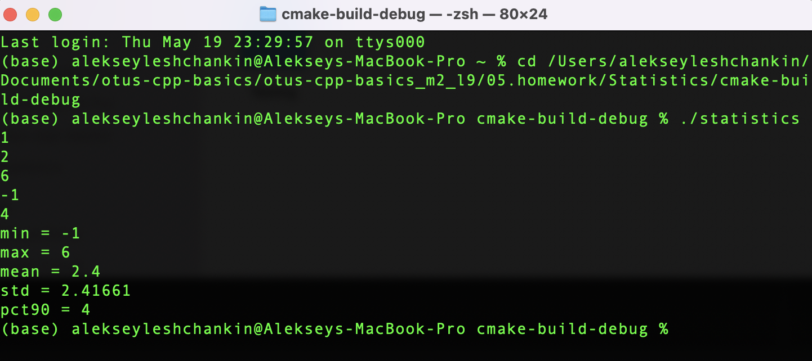

# OTUS C++ Basic курс

## Расчёт статистических характеристик последовательности

В данном репозитории реализован функционал считывания последовательности из стандартного ввода и набор классов для расчета статистических характеристик
этой последовательности

## Инструкция по сборке

Требуется компиялтор с поддержкой C++17

Сборка осуществлялась встроенными средствами Clion:

"/Users/alekseyleshchankin/Library/Application Support/JetBrains/Toolbox/apps/CLion/ch-0/213.5744.254/CLion.app/Contents/bin/cmake/mac/bin/cmake" 

--build /Users/alekseyleshchankin/Documents/otus-cpp-basics/otus-cpp-basics_m2_l9/05.homework/Statistics/cmake-build-debug 
--target statistics 
-- -j 6

## Пример работы

Пример показан для платформы macOS Monterey version 12.0 (21A344) (остановка ввода последовательности осуществляется
путём нажатия Ctrl+D):

