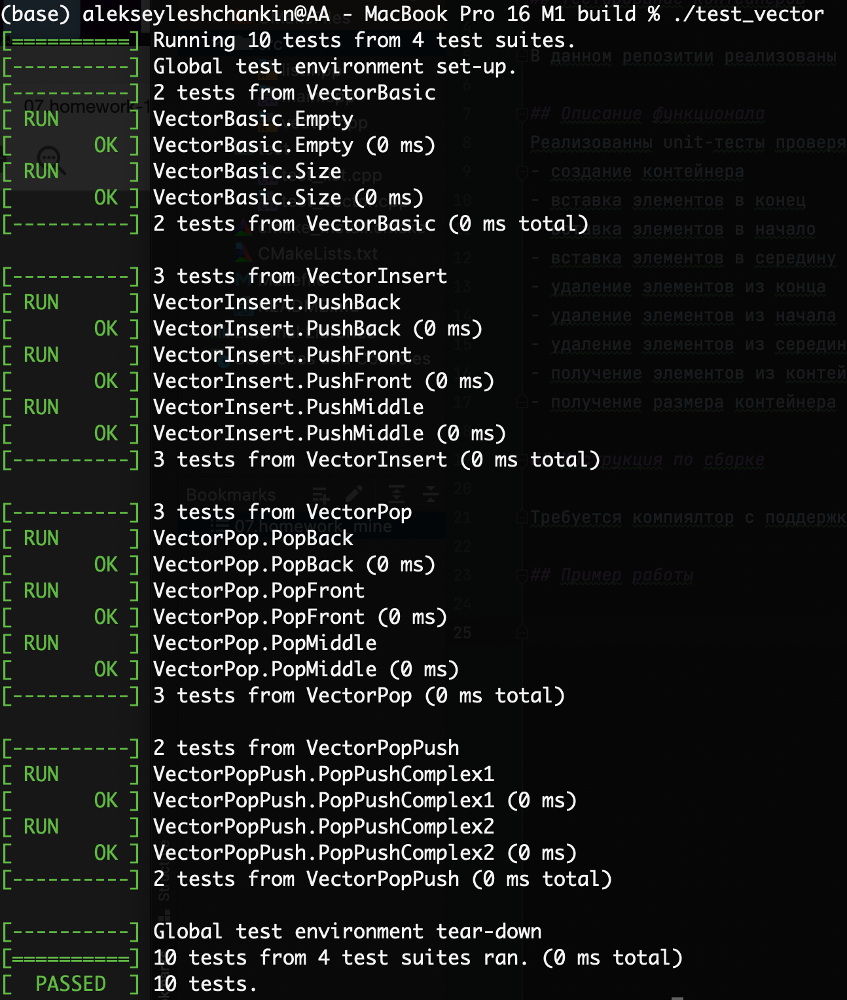

# OTUS C++ Basic курс

## Тестирование контейнеров

В данном репозитии реализованы unit-тесты на два контейнера – последовательного и спискового типов.

## Описание функционала
Реализованны unit-тесты проверяют основную функциональность контейнеров: 
- создание контейнера
- вставка элементов в конец
- вставка элементов в начало
- вставка элементов в середину
- удаление элементов из конца
- удаление элементов из начала
- удаление элементов из середины
- получение элементов из контейнера
- получение размера контейнера (фактическое количество элементов)

## Инструкция по сборке

Требуется компилятор с поддержкой C++17

gtest устанавливался следующим образом:

git clone https://github.com/google/googletest.git

cmake ..-DCMAKE_INSTALL_PREFIX="/Users/alekseyleshchankin/Documents/otus-cpp-basics/otus-cpp-basics_m2_l13 (unit testing tools)/07.homework/prebuild_gtest"

cmake .. -DGTEST_ROOT="/Users/alekseyleshchankin/Documents/otus-cpp-basics/otus-cpp-basics_m2_l13 (unit testing tools)/07.homework/prebuild_gtest"

## Пример работы

