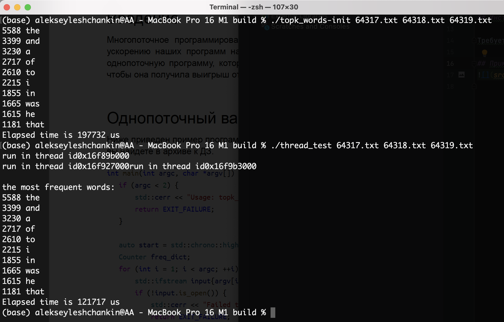

# OTUS C++ Basic курс

## Многопоточный подсчет самых частых слов

Программа выводит 10 самых частых слов, которые встретились во всех входных файлах, и печатает время
своей работы в миллисекундах.

## Описание функционала
- Каждый файл обрабатывается в отдельном потоке
- У каждого потока свой словарь, которые потом сливаются воедино
- Тестовые файлы хранятся в папке build

## Инструкция по сборке

Требуется компилятор с поддержкой C++17

## Пример работы

