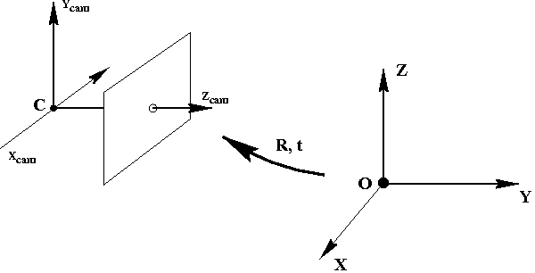
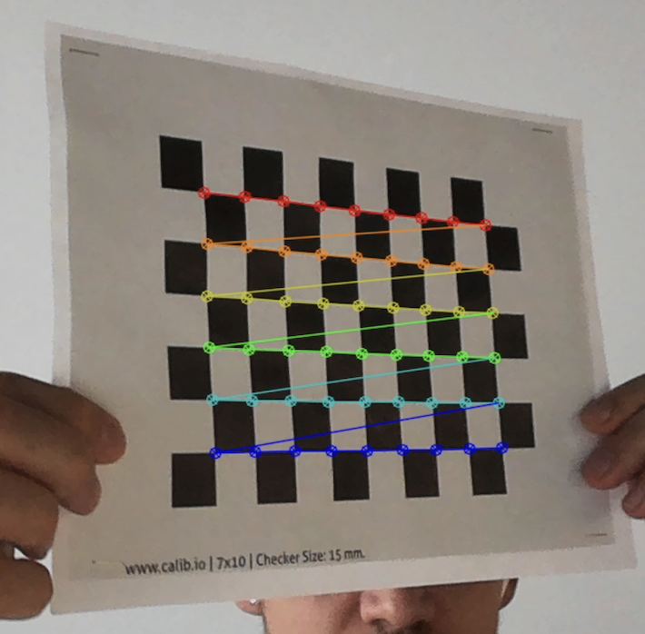
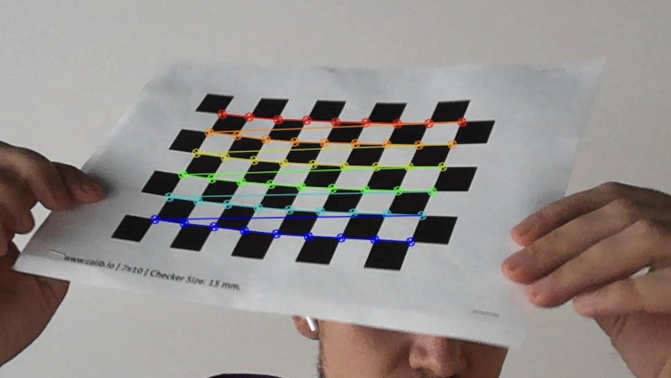
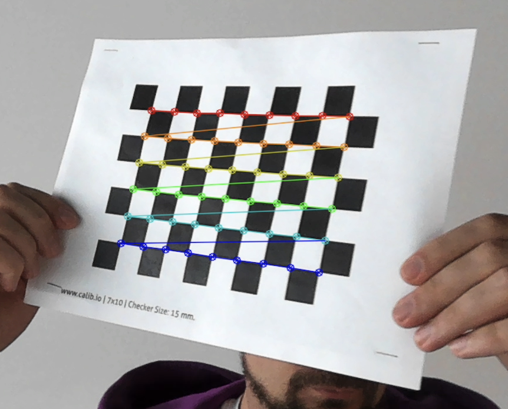
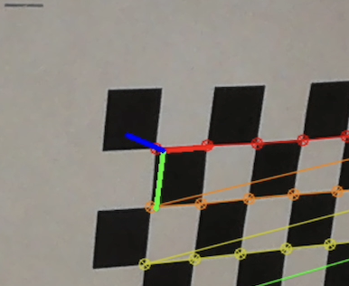

# OTUS C++ Basic курс

## Программный функционал для получения калибровки камеры и использования ее для AR (Augmented Reality) целей

Калибровка — это процесс оценки параметров камеры.

Это значит, что у нас есть полная информация (технические характеристики или расчетные коэффициенты) о камере, необходимые для определения точной взаимосвязи между 3D‑точкой в реальном мире и соответствующим 2D‑изображением, проекцией (каждым пикселем) на изображении, снятом откалиброванной камерой.

 

Обычно для этого необходимо получить два вида параметров:

- Внутренние параметры системы камера/объектив. Например, фокусное расстояние, оптический центр и коэффициенты радиального искажения объектива.
- Внешние параметры, связанные с ориентацией (поворотом и смещением) камеры относительно некоторой мировой системы координат.

Цель процесса калибровки — найти матрицу K размеров 3 × 3, матрицу вращения 3 × 3 R и вектор перевода t, 
используя набор известных трехмерных точек (Xw, Yw, Zw) и соответствующие им координаты изображения (u, v). 
Когда мы получаем значения внутренних и внешних параметров, камера считается откалиброванной.

Таким образом, алгоритм калибровки камеры имеет следующие входы и выходы:

Входные данные: коллекция изображений с точками, чьи координаты 2D-изображения и 3D-мировые координаты известны.
Выходы: собственная матрица камеры 3 × 3, поворот и перемещение каждого изображения.

## Definition of Done
Реализован код, который умеет:
1) захватывать изображения встроенной в ноутбук камеры
2) детектировать на полученных изображениях паттерн шахматной доски
3) находить калибровки камеры для набора изображений
4) использовать полученные калибровки для realtime отрисовки виртуальных осей XYZ.

План:
0) Научиться получить изображения со встроенной вэб камеры либо подключенной USB камеры и выводить их на экран
Для этого потребуется:
cv::VideoCapture, cv::imshow, cv::waitKey

1) Распечатать паттерн шахматной доски на плотном листке бумаги (Tarrget type: Checkerboard):
https://calib.io/pages/camera-calibration-pattern-generator
2) Научиться на изображениях с камеры детектировать углы шахматной доски и отрисовывать их в realtime.
Для этого потребуется: cv::findChessboardCorners, cv::cornerSubPix, cv::drawChessboardCorners
3) Научиться накапливать задетектрованные углы шахматной доски до тех пор, пока задектированных досок не накопится 50, после чего выходить из цикла получения изображений с вэбки.
4) После накопления нужного количества углов досок, нужно скалибровать камеру по полученным углам.
Для этого потребуется: cv::calibrateCamera
5) (*) На этом этапе у нас уже есть внутренняя калибровка используемой камеры.
Для того, чтобы убедиться, что она корректна и поиграться с AR можем использовать: cv::drawFrameAxes, cv::solvePnP

## Зависимости 
У вас должен быть OpenCV 2.4.8+

Инструкция по установке OpenCV/c++ на Mac M1 c CLion IDE и CMake

- homebrew(https://brew.sh/)
- brew install cmake
- git clone https://github.com/opencv/opencv.git
- mkdir build
- cmake ../opencv/ .
- arch -arm64 cmake ../opencv/ -DWITH_QT=OFF -DWITH_OPENGL=OFF -DFORCE_VTK=OFF -DWITH_TBB=OFF -DWITH_GDAL=OFF -DWITH_XINE=OFF -DBUILD_EXAMPLES=OFF -DBUILD_ZLIB=OFF -DBUILD_TESTS=OFF .
- arch -arm64 sudo make -j 4
- arch -arm64 sudo make install

Cmake.txt file content

- cmake_minimum_required(VERSION 2.8)
- project( Open_CV_Project )
- find_package(OpenCV REQUIRED)
- include_directories( ${OpenCV_INCLUDE_DIRS} )
- add_executable( Open_CV_Project main.cpp )
- target_link_libraries( Open_CV_Project  ${OpenCV_LIBS})

## Инструкция по сборке

Требуется компилятор с поддержкой C++17

## Пример работы
https://youtu.be/QUYO5EKcvuA

Определение углов доски:

Определение базиса:

